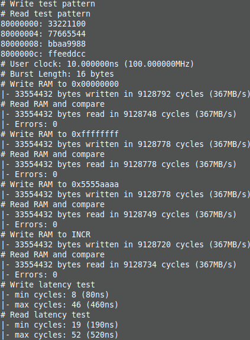
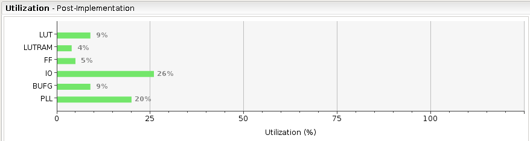

### Lightweight AXI-4 DDR3 Controller

Github:   [https://github.com/ultraembedded/core_ddr3_controller](https://github.com/ultraembedded/core_ddr3_controller)

This IP is a compact DDR3 memory controller in Verilog aimed at FPGA projects where the bandwidth required from the memory is lower than DDR3 DRAMs can provide, and where simplicity and LUT usage are more important than maximising the DDR performance.  
It currently supports Xilinx 7 series (Artix, Kintex) and Lattice ECP5 FPGAs, but other FPGA specific DFI compatible PHYs might be added later.

The idea with this project is to run DDR3 at a much slower clock frequency than the maximum supported by the DDR part, reducing the complexity required in the DDR3 controller by giving the bus interface much more margin and tolerance.  
This can make sense for some FPGA projects where the fabric speed is limiting factor in the design, rather than the external DDR memory interface speed, and where typically an SDR DRAM could have been used but wasn't (for reasons of availability, capacity, cost per bit).

DDR3 has a very high signalling rate, and in order for this to work reliably, it has added complexity such as;
* Read/write levelling
* ZQ calibration

In normal operating mode (DLL-on mode), DDR3 has a minimum clock frequency (300MHz+). However, it is possible to turn the DDR3 DLL off (in most DRAM parts) and run at frequencies <= 125MHz.

DLL-off mode (which this memory controller utilises) is listed as an optional feature for DDR3 parts to implement, however it seems that the popular DDR3 parts do implement it (and testing proves that it works well)!

##### Design Targets
* Run at a reduced DDR clock speed (< 125MHz) to decrease the complexity of the DDR3 PHY, ease timing closure, reduce design LUT usage.
* Support multiple FPGA vendors/toolchains.
* Achieve high performance (for the clock speed) sequential read/write performance.
* Support an AXI-4 target port with burst capabilities.
* To be substantially smaller (using fewer FPGA LUTs) than commercial DDR3 cores (such as Xilinx MIG).
* To be open-source, free to use, free to modify.

##### Features
* 32-bit AXI-4 target port supporting INCR bursts.
* Support up to 8 open rows, allowing back-to-back read/write bursts within an open row.
* Standardized DFI interface between memory controller core and PHY.
* PHYs: Xilinx 7 series, Lattice ECP5

##### Performance / Area
Performance for sequential burst accesses is good, as a burst of the same type - read or write, will be pipelined to an already open row.  
Currently, there is no capability for read/write re-ordering/coalescing, so random read/write performance will not be optimal (this might be addressed in future releases).

On the Digitalent Arty A7 running at 50MHz (max 200MBytes/s of bandwidth available), performing sequential reads / writes;  


As for area, on the Xilinx Artix 7 (XC7A35T), the area used by the core (plus a small UART to AXI-4 bridge);  


It should be noted that the same project using the Xilinx MIG DDR3 controller takes 33% of the FPGA LUTs (vs 9% with this core).

##### Testing
Verified under simulation, then exercised on the following FPGA boards;
* Digilent Arty A7 (Xilinx Artix + MT41K128M16JT-125)
* LambaConcept ECPIX-5 (Lattice ECP5 + MT41K256M16RE-125)

The performance and error checking was done using this [RAM Tester](https://github.com/ultraembedded/core_ram_tester).  
These boards have also booted Linux reliably with this DDR core, at the same time as been stressed by video frame buffer accesses to DDR.

##### Future Work
Weaknesses/areas of improvements;
* ECP5 PHY is sub-optimal - relies on aligning the read data capture to the internal clock instead of capturing on the DQS input. This works reliably on the board/clock speeds tested, but really could do with fixing!
* Support for AXI-4 WRAP bursts - these are often used with cache controllers which do critical word first fetches.
* Add optional DDR scheduler logic on the frontend of the core to improve read/write thrashing performance (re-order and coalesce).
* The PHY modules have tuneable delays, it would be good if these were automatically tuned at startup to simplify integration efforts (although this would increase LUT usage).

##### Integration
If you would like help with getting this core integrated into your FPGA project, contact me:
```
admin@ultra-embedded.com
```
